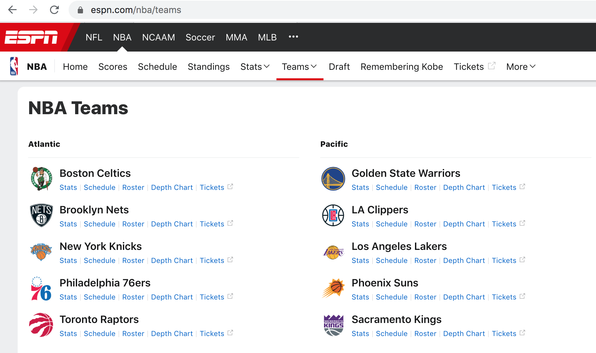
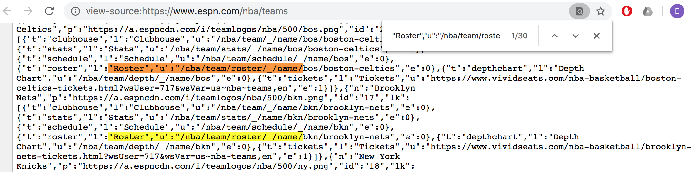
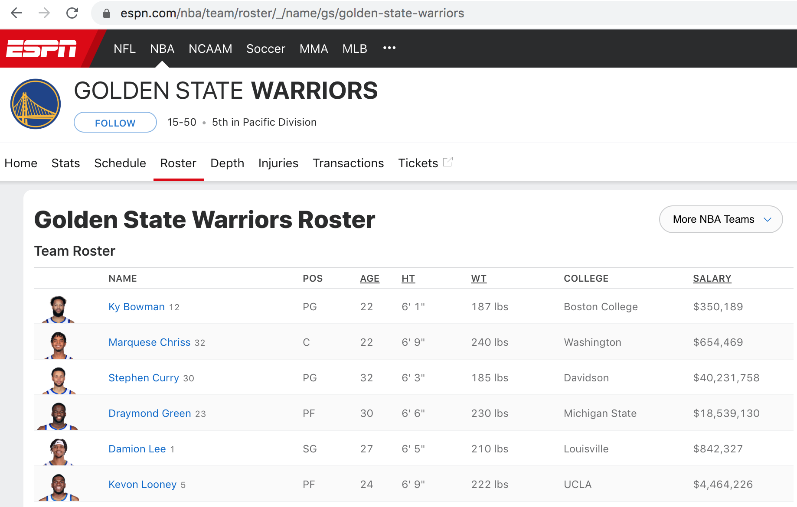
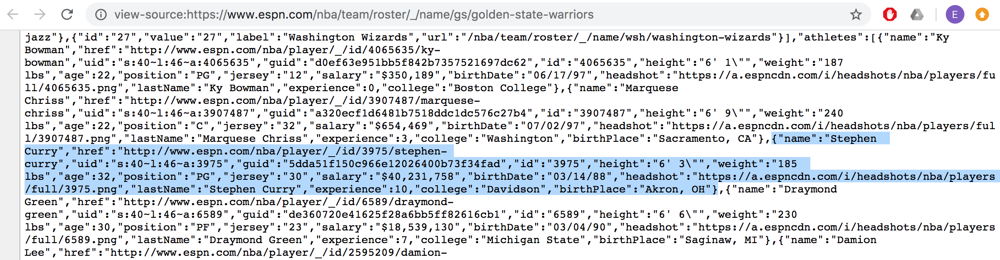
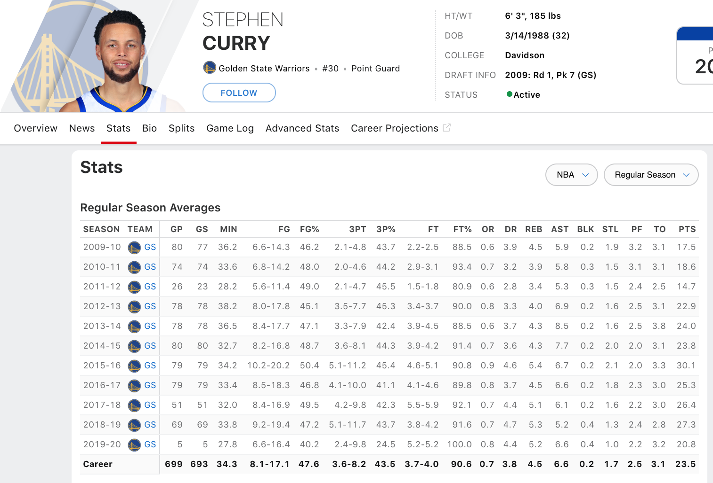
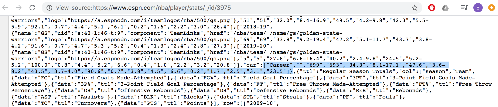
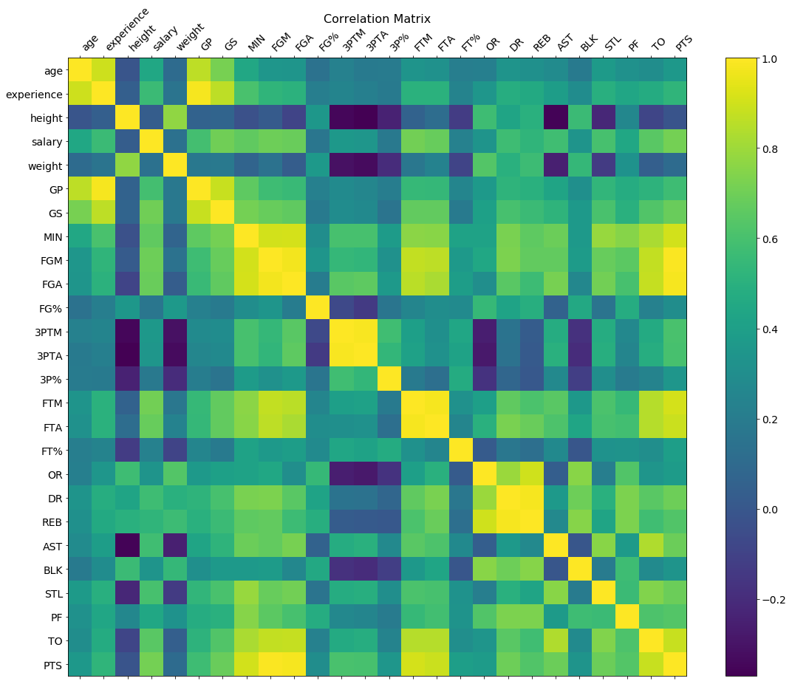
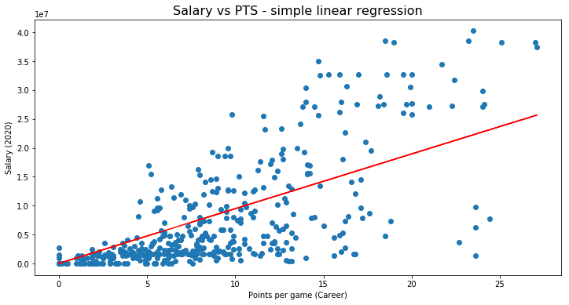

# Web scraping in Python: gathering and analyzing NBA player stats

Erick Lu

March 31, 2020 - [Jupyter Notebook](https://erilu.github.io/web-scraping-NBA-statistics/)

* [Introduction](#Introduction)
* [Scrape roster information for each NBA team](#Scrape-roster-information-for-each-NBA-team)
* [Scrape player stats for career averages](#Scrape-player-stats-for-career-averages)
* [Joining and cleaning the data](#Joining-and-cleaning-the-data)
* [Calculating statistics](#Calculating-statistics)
* [Conclusion](#Conclusion)

## Introduction

In this project, I use Python to “scrape” ESPN for stats on all the players in the NBA, clean and organize the data into a data science-friendly format, and calculate some interesting statistics. Web scraping is a useful technique for extracting data from websites that don’t offer formatted, raw data for download.

As an example, I will be scraping data from the rosters of each team in the NBA for information such as player age, height, weight, and salary. I will also loop through each individual player's stats page and extract career averages such as points per game, free throw percentages, and more (as of currently, March 2020).

We can use this data to answer questions such as:
* Do factors such as age, height, weight, etc. correlate with player performance? (i.e. does height matter?)
* What is the average salary paid by each team in the NBA, and which player earns the most on each team?
* How much more do better players cost? Can we model the average price of hiring a player given his performance? If so, what is the cost per increase in points per game?

I've exported the data to a nicely organized csv file, accessible in the [GitHub repo](https://github.com/erilu/web-scraping-NBA-statistics) for this project, in case you would like to analyze it yourself. You can also run the python script `scrape_nba_statistics.py` to re-scrape ESPN for up-to-date data.

In the following sections, I will describe how to loop through ESPN page sources using `urllib`, extract information using `re` (regular expressions), organize player statistics in `pandas` DataFrames, and perform some simple modeling using `scikit-learn`.

## Scrape roster information for each NBA team

We will first take a look at the structure of the website and figure out which web pages we need to scrape information from. The teams page at https://www.espn.com/nba/teams looks like the following:



This looks very promising. All the teams are listed on this page, which means that they can easily be extracted from the page source. Let’s take a look at the page source to see if we can find URLs for each team's roster:



It looks like URLs for each of the teams rosters are listed in the page source with the following format: https://www.espn.com/nba/team/roster/_/name/team/team-name, as shown in the highlighted portion of the image above. Given that these all follow the same format, we can use regular expressions to pull out a list of all the team names from the page source, and then construct the roster URLs using the format above. Start by importing the `urllib` and `re` packages in Python:


```python
import re
import urllib
from time import sleep
```

Now, let’s create a function that will extract all the team names from http://www.espn.com/nba/teams and construct roster URLs for each of the teams:


```python
# This method finds the urls for each of the rosters in the NBA using regexes.
def build_team_urls():
    # Open the espn teams webpage and extract the names of each roster available.
    f = urllib.request.urlopen('http://www.espn.com/nba/teams')
    teams_source = f.read().decode('utf-8')
    teams = dict(re.findall("www\.espn\.com/nba/team/_/name/(\w+)/(.+?)\",", teams_source))
    # Using the names of the rosters, create the urls of each roster
    roster_urls = []
    for key in teams.keys():
        # each roster webpage follows this general pattern.
        roster_urls.append('http://www.espn.com/nba/team/roster/_/name/' + key + '/' + teams[key])
        teams[key] = str(teams[key])
    return dict(zip(teams.values(), roster_urls))
```


```python
rosters = build_team_urls()
rosters
```


    {'atlanta-hawks': 'http://www.espn.com/nba/team/roster/_/name/atl/atlanta-hawks',
     'boston-celtics': 'http://www.espn.com/nba/team/roster/_/name/bos/boston-celtics',
     'brooklyn-nets': 'http://www.espn.com/nba/team/roster/_/name/bkn/brooklyn-nets',
     'charlotte-hornets': 'http://www.espn.com/nba/team/roster/_/name/cha/charlotte-hornets',
     'chicago-bulls': 'http://www.espn.com/nba/team/roster/_/name/chi/chicago-bulls',
     'cleveland-cavaliers': 'http://www.espn.com/nba/team/roster/_/name/cle/cleveland-cavaliers',
     'dallas-mavericks': 'http://www.espn.com/nba/team/roster/_/name/dal/dallas-mavericks',
     'denver-nuggets': 'http://www.espn.com/nba/team/roster/_/name/den/denver-nuggets',
     'detroit-pistons': 'http://www.espn.com/nba/team/roster/_/name/det/detroit-pistons',
     'golden-state-warriors': 'http://www.espn.com/nba/team/roster/_/name/gs/golden-state-warriors',
     'houston-rockets': 'http://www.espn.com/nba/team/roster/_/name/hou/houston-rockets',
     'indiana-pacers': 'http://www.espn.com/nba/team/roster/_/name/ind/indiana-pacers',
     'la-clippers': 'http://www.espn.com/nba/team/roster/_/name/lac/la-clippers',
     'los-angeles-lakers': 'http://www.espn.com/nba/team/roster/_/name/lal/los-angeles-lakers',
     'memphis-grizzlies': 'http://www.espn.com/nba/team/roster/_/name/mem/memphis-grizzlies',
     'miami-heat': 'http://www.espn.com/nba/team/roster/_/name/mia/miami-heat',
     'milwaukee-bucks': 'http://www.espn.com/nba/team/roster/_/name/mil/milwaukee-bucks',
     'minnesota-timberwolves': 'http://www.espn.com/nba/team/roster/_/name/min/minnesota-timberwolves',
     'new-orleans-pelicans': 'http://www.espn.com/nba/team/roster/_/name/no/new-orleans-pelicans',
     'new-york-knicks': 'http://www.espn.com/nba/team/roster/_/name/ny/new-york-knicks',
     'oklahoma-city-thunder': 'http://www.espn.com/nba/team/roster/_/name/okc/oklahoma-city-thunder',
     'orlando-magic': 'http://www.espn.com/nba/team/roster/_/name/orl/orlando-magic',
     'philadelphia-76ers': 'http://www.espn.com/nba/team/roster/_/name/phi/philadelphia-76ers',
     'phoenix-suns': 'http://www.espn.com/nba/team/roster/_/name/phx/phoenix-suns',
     'portland-trail-blazers': 'http://www.espn.com/nba/team/roster/_/name/por/portland-trail-blazers',
     'sacramento-kings': 'http://www.espn.com/nba/team/roster/_/name/sac/sacramento-kings',
     'san-antonio-spurs': 'http://www.espn.com/nba/team/roster/_/name/sa/san-antonio-spurs',
     'toronto-raptors': 'http://www.espn.com/nba/team/roster/_/name/tor/toronto-raptors',
     'utah-jazz': 'http://www.espn.com/nba/team/roster/_/name/utah/utah-jazz',
     'washington-wizards': 'http://www.espn.com/nba/team/roster/_/name/wsh/washington-wizards'}


The function `build_team_urls()` returns a dictionary that matches team names with their corresponding roster URL. Given this information, we can systematically loop through all of the rosters and use regular expressions to extract player information for each team.

In order to figure out how to scrape the rosters, let’s take a look at the Golden State Warriors' roster page as an example:



Information for each player is nicely laid out in a table, meaning that the data is likely obtainable using regular expressions. Taking a look at the page source reveals that each player’s name and information are all provided in blocks of what apppear to be `json`, highlighted below:



Given the standardized format of the data for each player, this information is indeed extractable using regular expressions. First, we should read in the roster webpage using `urllib.request.urlopen`:


```python
url = "https://www.espn.com/nba/team/roster/_/name/gs/golden-state-warriors"
f = urllib.request.urlopen(url)
roster_source = f.read().decode('utf-8')
```

Then, we construct the regex that will return information for each of the players on the roster webpage.


```python
player_regex = ('\{\"name\"\:\"(\w+\s\w+)\",\"href\"\:\"http\://www\.espn\.com/nba/player/.*?\",(.*?)\}')
player_regex
player_info = re.findall(player_regex, roster_source)
player_info[0:4]
```


    [('Ky Bowman',
      '"uid":"s:40~l:46~a:4065635","guid":"d0ef63e951bb5f842b7357521697dc62","id":"4065635","height":"6\' 1\\"","weight":"187 lbs","age":22,"position":"PG","jersey":"12","salary":"$350,189","birthDate":"06/17/97","headshot":"https://a.espncdn.com/i/headshots/nba/players/full/4065635.png","lastName":"Ky Bowman","experience":0,"college":"Boston College"'),
     ('Marquese Chriss',
      '"uid":"s:40~l:46~a:3907487","guid":"a320ecf1d6481b7518ddc1dc576c27b4","id":"3907487","height":"6\' 9\\"","weight":"240 lbs","age":22,"position":"C","jersey":"32","salary":"$654,469","birthDate":"07/02/97","headshot":"https://a.espncdn.com/i/headshots/nba/players/full/3907487.png","lastName":"Marquese Chriss","experience":3,"college":"Washington","birthPlace":"Sacramento, CA"'),
     ('Stephen Curry',
      '"uid":"s:40~l:46~a:3975","guid":"5dda51f150c966e12026400b73f34fad","id":"3975","height":"6\' 3\\"","weight":"185 lbs","age":32,"position":"PG","jersey":"30","salary":"$40,231,758","birthDate":"03/14/88","headshot":"https://a.espncdn.com/i/headshots/nba/players/full/3975.png","lastName":"Stephen Curry","experience":10,"college":"Davidson","birthPlace":"Akron, OH"'),
     ('Draymond Green',
      '"uid":"s:40~l:46~a:6589","guid":"de360720e41625f28a6bb5ff82616cb1","id":"6589","height":"6\' 6\\"","weight":"230 lbs","age":30,"position":"PF","jersey":"23","salary":"$18,539,130","birthDate":"03/04/90","headshot":"https://a.espncdn.com/i/headshots/nba/players/full/6589.png","lastName":"Draymond Green","experience":7,"college":"Michigan State","birthPlace":"Saginaw, MI"')]


As you can see, `player_info` is a list of tuples, in which each player name is paired with a set of information (height, weight, age, etc.) that is organized in `json` format. We can use the `json` package in Python to convert the information into a Python dictionary:


```python
import json
draymond = json.loads("{"+player_info[3][1]+"}")
draymond
```


    {'age': 30,
     'birthDate': '03/04/90',
     'birthPlace': 'Saginaw, MI',
     'college': 'Michigan State',
     'experience': 7,
     'guid': 'de360720e41625f28a6bb5ff82616cb1',
     'headshot': 'https://a.espncdn.com/i/headshots/nba/players/full/6589.png',
     'height': '6\' 6"',
     'id': '6589',
     'jersey': '23',
     'lastName': 'Draymond Green',
     'position': 'PF',
     'salary': '$18,539,130',
     'uid': 's:40~l:46~a:6589',
     'weight': '230 lbs'}


In the example above, all of the pertinent information for Draymond Green is now stored into a Python dictionary named `draymond`. Let's use the snippets of code above to construct a function which loops through each player in a given roster and scrapes their information:


```python
def get_player_info(roster_url):
    f = urllib.request.urlopen(roster_url)
    roster_source = f.read().decode('utf-8')
    sleep(0.5)
    player_regex = ('\{\"name\"\:\"(\w+\s\w+)\",\"href\"\:\"http\://www\.espn\.com/nba/player/.*?\",(.*?)\}')
    player_info = re.findall(player_regex, roster_source)
    player_dict = dict()
    for player in player_info:
        player_dict[player[0]] = json.loads("{"+player[1]+"}")
    return(player_dict)
```

We can now loop through each team in `rosters` and run `get_player_info()`, storing the output in a dictionary called `all_players`:


```python
all_players = dict()
for team in rosters.keys():
    print("Gathering player info for team: " + team)
    all_players[team] = get_player_info(rosters[team])
```

    Gathering player info for team: boston-celtics
    Gathering player info for team: brooklyn-nets
    Gathering player info for team: new-york-knicks
    Gathering player info for team: philadelphia-76ers
    Gathering player info for team: toronto-raptors
    Gathering player info for team: chicago-bulls
    Gathering player info for team: cleveland-cavaliers
    Gathering player info for team: detroit-pistons
    Gathering player info for team: indiana-pacers
    Gathering player info for team: milwaukee-bucks
    Gathering player info for team: atlanta-hawks
    Gathering player info for team: charlotte-hornets
    Gathering player info for team: miami-heat
    Gathering player info for team: orlando-magic
    Gathering player info for team: washington-wizards
    Gathering player info for team: denver-nuggets
    Gathering player info for team: minnesota-timberwolves
    Gathering player info for team: oklahoma-city-thunder
    Gathering player info for team: portland-trail-blazers
    Gathering player info for team: utah-jazz
    Gathering player info for team: golden-state-warriors
    Gathering player info for team: la-clippers
    Gathering player info for team: los-angeles-lakers
    Gathering player info for team: phoenix-suns
    Gathering player info for team: sacramento-kings
    Gathering player info for team: dallas-mavericks
    Gathering player info for team: houston-rockets
    Gathering player info for team: memphis-grizzlies
    Gathering player info for team: new-orleans-pelicans
    Gathering player info for team: san-antonio-spurs


After running this code, the `all_players` dictionary should be a dictionary of dictionaries of dictionaries. This sounds complicated, but let's walk through what it looks like. The first level of keys should correspond to teams:


```python
all_players.keys()
```


    dict_keys(['boston-celtics', 'brooklyn-nets', 'new-york-knicks', 'philadelphia-76ers', 'toronto-raptors', 'chicago-bulls', 'cleveland-cavaliers', 'detroit-pistons', 'indiana-pacers', 'milwaukee-bucks', 'atlanta-hawks', 'charlotte-hornets', 'miami-heat', 'orlando-magic', 'washington-wizards', 'denver-nuggets', 'minnesota-timberwolves', 'oklahoma-city-thunder', 'portland-trail-blazers', 'utah-jazz', 'golden-state-warriors', 'la-clippers', 'los-angeles-lakers', 'phoenix-suns', 'sacramento-kings', 'dallas-mavericks', 'houston-rockets', 'memphis-grizzlies', 'new-orleans-pelicans', 'san-antonio-spurs'])


Within a team, the keys should correspond to player names. Let's zoom in on the LA Lakers:


```python
all_players["los-angeles-lakers"].keys()
```


    dict_keys(['Kostas Antetokounmpo', 'Avery Bradley', 'Devontae Cacok', 'Alex Caruso', 'Quinn Cook', 'Anthony Davis', 'Jared Dudley', 'Danny Green', 'Dwight Howard', 'LeBron James', 'Kyle Kuzma', 'JaVale McGee', 'Markieff Morris', 'Rajon Rondo', 'Dion Waiters'])


Now we can choose which player to look at. Let's choose LeBron James as an example:


```python
all_players["los-angeles-lakers"]["LeBron James"]
```


    {'age': 35,
     'birthDate': '12/30/84',
     'birthPlace': 'Akron, OH',
     'experience': 16,
     'guid': '1f6592b3ff53d3218dc56038d48c1786',
     'headshot': 'https://a.espncdn.com/i/headshots/nba/players/full/1966.png',
     'height': '6\' 9"',
     'id': '1966',
     'jersey': '23',
     'lastName': 'LeBron James',
     'position': 'SF',
     'salary': '$37,436,858',
     'uid': 's:40~l:46~a:1966',
     'weight': '250 lbs'}


A dictionary with information about LeBron James is returned. We can extract information even more precisely by specifying which field we are interested in. Let's get his salary:


```python
all_players["los-angeles-lakers"]["LeBron James"]["salary"]
```


    '$37,436,858'


In order to make data analysis easier, we can re-format this dictionary into a `pandas` DataFrame. The function `pd.DataFrame.from_dict()` can turn a dictionary of dictionaries into a `pandas` DataFrame, as demonstrated below:


```python
import pandas as pd
gsw = pd.DataFrame.from_dict(all_players["golden-state-warriors"], orient = "index")
gsw
```


<div>
<table border="1" class="dataframe">
  <thead>
    <tr style="text-align: right;">
      <th></th>
      <th>uid</th>
      <th>guid</th>
      <th>id</th>
      <th>height</th>
      <th>weight</th>
      <th>age</th>
      <th>position</th>
      <th>jersey</th>
      <th>salary</th>
      <th>birthDate</th>
      <th>headshot</th>
      <th>lastName</th>
      <th>experience</th>
      <th>college</th>
      <th>birthPlace</th>
      <th>hand</th>
    </tr>
  </thead>
  <tbody>
    <tr>
      <th>Alen Smailagic</th>
      <td>s:40~l:46~a:4401415</td>
      <td>6ed3f8924bfef2e70329ebd6a104ecae</td>
      <td>4401415</td>
      <td>6' 10"</td>
      <td>215 lbs</td>
      <td>19</td>
      <td>PF</td>
      <td>6</td>
      <td>$898,310</td>
      <td>08/18/00</td>
      <td>https://a.espncdn.com/i/headshots/nba/players/...</td>
      <td>Alen Smailagic</td>
      <td>0</td>
      <td>NaN</td>
      <td>NaN</td>
      <td>NaN</td>
    </tr>
    <tr>
      <th>Andrew Wiggins</th>
      <td>s:40~l:46~a:3059319</td>
      <td>064c19d065276a21ca99fdfb296fe05d</td>
      <td>3059319</td>
      <td>6' 7"</td>
      <td>197 lbs</td>
      <td>25</td>
      <td>SF</td>
      <td>22</td>
      <td>$27,504,630</td>
      <td>02/23/95</td>
      <td>https://a.espncdn.com/i/headshots/nba/players/...</td>
      <td>Andrew Wiggins</td>
      <td>5</td>
      <td>Kansas</td>
      <td>Thornhill, ON</td>
      <td>NaN</td>
    </tr>
    <tr>
      <th>Chasson Randle</th>
      <td>s:40~l:46~a:2580898</td>
      <td>71b7154a3d81842448b623ee3e65d586</td>
      <td>2580898</td>
      <td>6' 2"</td>
      <td>185 lbs</td>
      <td>27</td>
      <td>PG</td>
      <td>25</td>
      <td>NaN</td>
      <td>02/05/93</td>
      <td>https://a.espncdn.com/i/headshots/nba/players/...</td>
      <td>Chasson Randle</td>
      <td>2</td>
      <td>Stanford</td>
      <td>Rock Island, IL</td>
      <td>NaN</td>
    </tr>
    <tr>
      <th>Damion Lee</th>
      <td>s:40~l:46~a:2595209</td>
      <td>41fafb6d47a66d8f79f94161918541a4</td>
      <td>2595209</td>
      <td>6' 5"</td>
      <td>210 lbs</td>
      <td>27</td>
      <td>SG</td>
      <td>1</td>
      <td>$842,327</td>
      <td>10/21/92</td>
      <td>https://a.espncdn.com/i/headshots/nba/players/...</td>
      <td>Damion Lee</td>
      <td>2</td>
      <td>Louisville</td>
      <td>NaN</td>
      <td>L</td>
    </tr>
    <tr>
      <th>Draymond Green</th>
      <td>s:40~l:46~a:6589</td>
      <td>de360720e41625f28a6bb5ff82616cb1</td>
      <td>6589</td>
      <td>6' 6"</td>
      <td>230 lbs</td>
      <td>30</td>
      <td>PF</td>
      <td>23</td>
      <td>$18,539,130</td>
      <td>03/04/90</td>
      <td>https://a.espncdn.com/i/headshots/nba/players/...</td>
      <td>Draymond Green</td>
      <td>7</td>
      <td>Michigan State</td>
      <td>Saginaw, MI</td>
      <td>NaN</td>
    </tr>
    <tr>
      <th>Eric Paschall</th>
      <td>s:40~l:46~a:3133817</td>
      <td>b67e5e0fa5cb209355845d165a49407e</td>
      <td>3133817</td>
      <td>6' 6"</td>
      <td>255 lbs</td>
      <td>23</td>
      <td>PF</td>
      <td>7</td>
      <td>$898,310</td>
      <td>11/04/96</td>
      <td>https://a.espncdn.com/i/headshots/nba/players/...</td>
      <td>Eric Paschall</td>
      <td>0</td>
      <td>Villanova</td>
      <td>North Tarrytown, NY</td>
      <td>NaN</td>
    </tr>
    <tr>
      <th>Jordan Poole</th>
      <td>s:40~l:46~a:4277956</td>
      <td>4b0492b5a52f267fe84098ef6d2e2bdf</td>
      <td>4277956</td>
      <td>6' 4"</td>
      <td>194 lbs</td>
      <td>20</td>
      <td>SG</td>
      <td>3</td>
      <td>$1,964,760</td>
      <td>06/19/99</td>
      <td>https://a.espncdn.com/i/headshots/nba/players/...</td>
      <td>Jordan Poole</td>
      <td>0</td>
      <td>Michigan</td>
      <td>Milwaukee, WI</td>
      <td>B</td>
    </tr>
    <tr>
      <th>Kevon Looney</th>
      <td>s:40~l:46~a:3155535</td>
      <td>10a8e77b877324c69966f0c4618caad6</td>
      <td>3155535</td>
      <td>6' 9"</td>
      <td>222 lbs</td>
      <td>24</td>
      <td>PF</td>
      <td>5</td>
      <td>$4,464,226</td>
      <td>02/06/96</td>
      <td>https://a.espncdn.com/i/headshots/nba/players/...</td>
      <td>Kevon Looney</td>
      <td>4</td>
      <td>UCLA</td>
      <td>Milwaukee, WI</td>
      <td>NaN</td>
    </tr>
    <tr>
      <th>Klay Thompson</th>
      <td>s:40~l:46~a:6475</td>
      <td>3411530a7ab7e8dce4f165d59a559520</td>
      <td>6475</td>
      <td>6' 6"</td>
      <td>215 lbs</td>
      <td>30</td>
      <td>SG</td>
      <td>11</td>
      <td>$32,742,000</td>
      <td>02/08/90</td>
      <td>https://a.espncdn.com/i/headshots/nba/players/...</td>
      <td>Klay Thompson</td>
      <td>8</td>
      <td>Washington State</td>
      <td>Los Angeles, CA</td>
      <td>NaN</td>
    </tr>
    <tr>
      <th>Ky Bowman</th>
      <td>s:40~l:46~a:4065635</td>
      <td>d0ef63e951bb5f842b7357521697dc62</td>
      <td>4065635</td>
      <td>6' 1"</td>
      <td>187 lbs</td>
      <td>22</td>
      <td>PG</td>
      <td>12</td>
      <td>$350,189</td>
      <td>06/17/97</td>
      <td>https://a.espncdn.com/i/headshots/nba/players/...</td>
      <td>Ky Bowman</td>
      <td>0</td>
      <td>Boston College</td>
      <td>NaN</td>
      <td>NaN</td>
    </tr>
    <tr>
      <th>Marquese Chriss</th>
      <td>s:40~l:46~a:3907487</td>
      <td>a320ecf1d6481b7518ddc1dc576c27b4</td>
      <td>3907487</td>
      <td>6' 9"</td>
      <td>240 lbs</td>
      <td>22</td>
      <td>C</td>
      <td>32</td>
      <td>$654,469</td>
      <td>07/02/97</td>
      <td>https://a.espncdn.com/i/headshots/nba/players/...</td>
      <td>Marquese Chriss</td>
      <td>3</td>
      <td>Washington</td>
      <td>Sacramento, CA</td>
      <td>NaN</td>
    </tr>
    <tr>
      <th>Mychal Mulder</th>
      <td>s:40~l:46~a:3936298</td>
      <td>f5a46c489e9aee6a1a74f67f9494132f</td>
      <td>3936298</td>
      <td>6' 4"</td>
      <td>184 lbs</td>
      <td>25</td>
      <td>G</td>
      <td>12</td>
      <td>NaN</td>
      <td>06/12/94</td>
      <td>https://a.espncdn.com/i/headshots/nba/players/...</td>
      <td>Mychal Mulder</td>
      <td>0</td>
      <td>Kentucky</td>
      <td>Toronto, ON</td>
      <td>NaN</td>
    </tr>
    <tr>
      <th>Stephen Curry</th>
      <td>s:40~l:46~a:3975</td>
      <td>5dda51f150c966e12026400b73f34fad</td>
      <td>3975</td>
      <td>6' 3"</td>
      <td>185 lbs</td>
      <td>32</td>
      <td>PG</td>
      <td>30</td>
      <td>$40,231,758</td>
      <td>03/14/88</td>
      <td>https://a.espncdn.com/i/headshots/nba/players/...</td>
      <td>Stephen Curry</td>
      <td>10</td>
      <td>Davidson</td>
      <td>Akron, OH</td>
      <td>NaN</td>
    </tr>
  </tbody>
</table>
</div>


In the DataFrame above, each of the parameters such as 'age', 'salary', etc. are organized in columns and each player is a row. This makes display of the data much easier to read and understand. Furthermore, it also places null values when pieces of data are missing--for example, Chasson Randle's salary information is missing from the website, so 'NaN' is automatically placed in the DataFrame.

DataFrames allow us to quickly make calculations, sort players based on their stats, and compare stats between teams. To make a DataFrame containing data from all the teams, we will loop through each team in `all_players`, construct DataFrames, label them with a `team` column, and aggregate them into a single DataFrame called `all_players_df`.


```python
all_players_df = pd.DataFrame()
# loop through each team, create a pandas DataFrame, and append
for team in all_players.keys():
    team_df = pd.DataFrame.from_dict(all_players[team], orient = "index")
    team_df['team'] = team
    all_players_df = all_players_df.append(team_df)
```


```python
all_players_df.head(5)
```


<div>
<table border="1" class="dataframe">
  <thead>
    <tr style="text-align: right;">
      <th></th>
      <th>age</th>
      <th>birthDate</th>
      <th>birthPlace</th>
      <th>college</th>
      <th>experience</th>
      <th>guid</th>
      <th>hand</th>
      <th>headshot</th>
      <th>height</th>
      <th>id</th>
      <th>jersey</th>
      <th>lastName</th>
      <th>position</th>
      <th>salary</th>
      <th>team</th>
      <th>uid</th>
      <th>weight</th>
    </tr>
  </thead>
  <tbody>
    <tr>
      <th>Brad Wanamaker</th>
      <td>30</td>
      <td>07/25/89</td>
      <td>Philadelphia, PA</td>
      <td>Pittsburgh</td>
      <td>1</td>
      <td>5aad35bbbb760e3958107639266768ae</td>
      <td>NaN</td>
      <td>https://a.espncdn.com/i/headshots/nba/players/...</td>
      <td>6' 3"</td>
      <td>6507</td>
      <td>9</td>
      <td>Brad Wanamaker</td>
      <td>PG</td>
      <td>$1,445,697</td>
      <td>boston-celtics</td>
      <td>s:40~l:46~a:6507</td>
      <td>210 lbs</td>
    </tr>
    <tr>
      <th>Carsen Edwards</th>
      <td>22</td>
      <td>03/12/98</td>
      <td>Houston, TX</td>
      <td>Purdue</td>
      <td>0</td>
      <td>4b8ebdfd01221567925035c1e0d0c337</td>
      <td>NaN</td>
      <td>https://a.espncdn.com/i/headshots/nba/players/...</td>
      <td>5' 11"</td>
      <td>4066407</td>
      <td>4</td>
      <td>Carsen Edwards</td>
      <td>PG</td>
      <td>$1,228,026</td>
      <td>boston-celtics</td>
      <td>s:40~l:46~a:4066407</td>
      <td>200 lbs</td>
    </tr>
    <tr>
      <th>Daniel Theis</th>
      <td>27</td>
      <td>04/04/92</td>
      <td>Germany</td>
      <td>NaN</td>
      <td>2</td>
      <td>ce75206c087f83ace6f9a8e3efbd9671</td>
      <td>NaN</td>
      <td>https://a.espncdn.com/i/headshots/nba/players/...</td>
      <td>6' 8"</td>
      <td>2451037</td>
      <td>27</td>
      <td>Daniel Theis</td>
      <td>C</td>
      <td>$5,000,000</td>
      <td>boston-celtics</td>
      <td>s:40~l:46~a:2451037</td>
      <td>245 lbs</td>
    </tr>
    <tr>
      <th>Enes Kanter</th>
      <td>27</td>
      <td>05/20/92</td>
      <td>Switzerland</td>
      <td>Kentucky</td>
      <td>8</td>
      <td>1e039b407b3daa6eeac69432aa6413fd</td>
      <td>NaN</td>
      <td>https://a.espncdn.com/i/headshots/nba/players/...</td>
      <td>6' 10"</td>
      <td>6447</td>
      <td>11</td>
      <td>Enes Kanter</td>
      <td>C</td>
      <td>$4,767,000</td>
      <td>boston-celtics</td>
      <td>s:40~l:46~a:6447</td>
      <td>250 lbs</td>
    </tr>
    <tr>
      <th>Gordon Hayward</th>
      <td>30</td>
      <td>03/23/90</td>
      <td>Indianapolis, IN</td>
      <td>Butler</td>
      <td>9</td>
      <td>56f675cb8f40a5aaee5f5747ec9099c5</td>
      <td>NaN</td>
      <td>https://a.espncdn.com/i/headshots/nba/players/...</td>
      <td>6' 7"</td>
      <td>4249</td>
      <td>20</td>
      <td>Gordon Hayward</td>
      <td>SF</td>
      <td>$32,700,690</td>
      <td>boston-celtics</td>
      <td>s:40~l:46~a:4249</td>
      <td>225 lbs</td>
    </tr>
  </tbody>
</table>
</div>


Now, `all_players_df` is a DataFrame with all the players in the NBA categorized by team. It contains player information such as age, salary, height, weight, etc. I'll export this data to a csv file, in case you readers out there want to read it in and play around with it yourself.


```python
all_players_df.to_csv("NBA_roster_info_all_players_mar2020.csv")
```

## Scrape player stats for career averages

We also want to scrape data coresponding to the performance of each player, in terms of points per game, field goal percentage, rebounds per game, etc. Our goal is to append this information to `all_players_df` so that we can compare player performance with traits such as height, salary, etc. We can find performance stats at each player's personal page on ESPN:



We'll want to extract the career stats in the bottom row, which can be found in the highlighted section of the source code below:



In order to extract the information above for each player in our DataFrame, we can construct URLs for player stats pages using the `id` column. Fortunately, the URL is standardized and very easy to construct. For example, using the `id` value of 3975 for Stephen Curry, the URL to open would be: https://www.espn.com/nba/player/stats/_/id/3975. Below is an example of extracting his career stats using regexes:


```python
url = "https://www.espn.com/nba/player/stats/_/id/3975"
f = urllib.request.urlopen(url)
sleep(0.3)
player_source = f.read().decode('utf-8')
# extract career stats using this regex
stats_regex = ('\[\"Career\",\"\",(.*?)\]\},\{\"ttl\"\:\"Regular Season Totals\"')
career_info = re.findall(stats_regex, player_source)
print(career_info)
```

    ['"699","693","34.3","8.1-17.1","47.6","3.6-8.2","43.5","3.7-4.0","90.6","0.7","3.8","4.5","6.6","0.2","1.7","2.5","3.1","23.5"']


We observe that some of the stats are complex and contain non-numerical symbols such as "-". In the example above, the range "3.7-4.0" is for the column "FT", which stands for "Free Throws Made-Attempted Per Game". We should split this up into two categories, "Free Throws Made (FTM)" and "Free Throws Attempted (FTA)", and do the same for field goals and 3 pointers. To do so, we can split the string based on "-" and then un-nest the list. We also need to convert the strings to floating point values.


```python
from itertools import chain
career_info = career_info[0].replace("\"", "").split(",")
career_info = list(chain.from_iterable([i.split("-") for i in career_info]))
career_info = list(map(float,career_info))
print(career_info)
```

    [699.0, 693.0, 34.3, 8.1, 17.1, 47.6, 3.6, 8.2, 43.5, 3.7, 4.0, 90.6, 0.7, 3.8, 4.5, 6.6, 0.2, 1.7, 2.5, 3.1, 23.5]


Now we can loop through each player in `all_players_df`, open their stats webpage, extract their career stats, and store the stats in a separate data frame called `career_stats_df` using the code below:


```python
career_stats_df = pd.DataFrame(columns = ["GP","GS","MIN","FGM", "FGA","FG%","3PTM","3PTA","3P%","FTM","FTA","FT%","OR","DR","REB","AST","BLK","STL","PF","TO","PTS"])
for player_index in all_players_df.index:
    url = "https://www.espn.com/nba/player/stats/_/id/" + str(all_players_df.loc[player_index]['id'])
    f = urllib.request.urlopen(url)
    sleep(0.3)
    player_source = f.read().decode('utf-8')
    # extract career stats using this regex
    stats_regex = ('\[\"Career\",\"\",(.*?)\]\},\{\"ttl\"\:\"Regular Season Totals\"')
    career_info = re.findall(stats_regex, player_source)
    try:
        # convert the stats to a list of floats, and add the entry to the DataFrame
        career_info = career_info[0].replace("\"", "").split(",")
        career_info = list(chain.from_iterable([i.split("-") for i in career_info]))
        career_info = list(map(float,career_info))
        career_stats_df = career_stats_df.append(pd.Series(career_info, index = career_stats_df.columns, name=player_index))
    except:
        # if no career stats were returned, the player was a rookie with no games played
        print(player_index + " has no info, ", end = "")
```

Some player webpages did not have career stats, which I found corresponded to rookies which had no games played. This threw an error in the loop, so I used a try/except clause to bypass the error and continue stripping content for the remaining players. Their stats are currently stored in the object `career_stats_df`:


```python
career_stats_df.head(5)
```


<div>
<table border="1" class="dataframe">
  <thead>
    <tr style="text-align: right;">
      <th></th>
      <th>GP</th>
      <th>GS</th>
      <th>MIN</th>
      <th>FGM</th>
      <th>FGA</th>
      <th>FG%</th>
      <th>3PTM</th>
      <th>3PTA</th>
      <th>3P%</th>
      <th>FTM</th>
      <th>...</th>
      <th>FT%</th>
      <th>OR</th>
      <th>DR</th>
      <th>REB</th>
      <th>AST</th>
      <th>BLK</th>
      <th>STL</th>
      <th>PF</th>
      <th>TO</th>
      <th>PTS</th>
    </tr>
  </thead>
  <tbody>
    <tr>
      <th>Brad Wanamaker</th>
      <td>99.0</td>
      <td>1.0</td>
      <td>15.7</td>
      <td>1.9</td>
      <td>4.3</td>
      <td>44.0</td>
      <td>0.5</td>
      <td>1.3</td>
      <td>38.0</td>
      <td>1.3</td>
      <td>...</td>
      <td>91.7</td>
      <td>0.2</td>
      <td>1.4</td>
      <td>1.7</td>
      <td>2.2</td>
      <td>0.1</td>
      <td>0.6</td>
      <td>1.6</td>
      <td>0.9</td>
      <td>5.6</td>
    </tr>
    <tr>
      <th>Carsen Edwards</th>
      <td>35.0</td>
      <td>0.0</td>
      <td>9.0</td>
      <td>1.1</td>
      <td>3.2</td>
      <td>32.7</td>
      <td>0.6</td>
      <td>1.9</td>
      <td>30.9</td>
      <td>0.3</td>
      <td>...</td>
      <td>84.6</td>
      <td>0.2</td>
      <td>1.1</td>
      <td>1.2</td>
      <td>0.6</td>
      <td>0.1</td>
      <td>0.3</td>
      <td>0.9</td>
      <td>0.4</td>
      <td>3.0</td>
    </tr>
    <tr>
      <th>Daniel Theis</th>
      <td>187.0</td>
      <td>62.0</td>
      <td>17.2</td>
      <td>2.6</td>
      <td>4.7</td>
      <td>55.4</td>
      <td>0.4</td>
      <td>1.1</td>
      <td>34.0</td>
      <td>1.1</td>
      <td>...</td>
      <td>75.3</td>
      <td>1.6</td>
      <td>3.1</td>
      <td>4.7</td>
      <td>1.2</td>
      <td>0.9</td>
      <td>0.5</td>
      <td>2.8</td>
      <td>0.7</td>
      <td>6.7</td>
    </tr>
    <tr>
      <th>Enes Kanter</th>
      <td>634.0</td>
      <td>222.0</td>
      <td>21.8</td>
      <td>4.8</td>
      <td>8.8</td>
      <td>54.2</td>
      <td>0.1</td>
      <td>0.2</td>
      <td>28.7</td>
      <td>2.0</td>
      <td>...</td>
      <td>77.6</td>
      <td>2.9</td>
      <td>4.7</td>
      <td>7.6</td>
      <td>0.9</td>
      <td>0.5</td>
      <td>0.4</td>
      <td>2.2</td>
      <td>1.5</td>
      <td>11.6</td>
    </tr>
    <tr>
      <th>Gordon Hayward</th>
      <td>634.0</td>
      <td>472.0</td>
      <td>30.8</td>
      <td>5.2</td>
      <td>11.6</td>
      <td>45.1</td>
      <td>1.3</td>
      <td>3.6</td>
      <td>36.6</td>
      <td>3.5</td>
      <td>...</td>
      <td>82.2</td>
      <td>0.7</td>
      <td>3.6</td>
      <td>4.4</td>
      <td>3.5</td>
      <td>0.4</td>
      <td>1.0</td>
      <td>1.7</td>
      <td>2.0</td>
      <td>15.3</td>
    </tr>
  </tbody>
</table>
<p>5 rows × 21 columns</p>
</div>


The stats for each player are now organized in a neat DataFrame. Here is a legend for what each of the abbreviations mean:

* GP:Games Played
* GS:Games Started
* MIN:Minutes Per Game
* FGM:Field Goals Made Per Game
* FGA:Field Goals Attempted Per Game
* FG%:Field Goal Percentage
* 3PTM:3-Point Field Goals Made Per Game
* 3PTA:3-Point Field Goals Attempted Per Game
* 3P%:3-Point Field Goal Percentage
* FTM:Free Throws Made Per Game
* FTA:Free Throws Attempted
* FT%:Free Throw Percentage
* OR:Offensive Rebounds Per Game
* DR:Defensive Rebounds Per Game
* REB:Rebounds Per Game
* AST:Assists Per Game
* BLK:Blocks Per Game
* STL:Steals Per Game
* PF:Fouls Per Game
* TO:Turnovers Per Game
* PTS:Points Per Game

I'll also export these stats to a csv file:


```python
career_stats_df.to_csv("NBA_player_stats_all_mar2020.csv")
```

## Joining and cleaning the data

We will now join `career_stats_df` with `all_players_df`, which will merge the content from both data frames based on rows that have the same index (player name). Players in `all_players_df` that are not included in `career_stats_df` will have `NaN` values for the joined columns.


```python
all_stats_df = all_players_df.join(career_stats_df)
```


```python
all_stats_df.head(5)
```


<div>
<table border="1" class="dataframe">
  <thead>
    <tr style="text-align: right;">
      <th></th>
      <th>age</th>
      <th>birthDate</th>
      <th>birthPlace</th>
      <th>college</th>
      <th>experience</th>
      <th>guid</th>
      <th>hand</th>
      <th>headshot</th>
      <th>height</th>
      <th>id</th>
      <th>...</th>
      <th>FT%</th>
      <th>OR</th>
      <th>DR</th>
      <th>REB</th>
      <th>AST</th>
      <th>BLK</th>
      <th>STL</th>
      <th>PF</th>
      <th>TO</th>
      <th>PTS</th>
    </tr>
  </thead>
  <tbody>
    <tr>
      <th>Brad Wanamaker</th>
      <td>30</td>
      <td>07/25/89</td>
      <td>Philadelphia, PA</td>
      <td>Pittsburgh</td>
      <td>1</td>
      <td>5aad35bbbb760e3958107639266768ae</td>
      <td>NaN</td>
      <td>https://a.espncdn.com/i/headshots/nba/players/...</td>
      <td>6' 3"</td>
      <td>6507</td>
      <td>...</td>
      <td>91.7</td>
      <td>0.2</td>
      <td>1.4</td>
      <td>1.7</td>
      <td>2.2</td>
      <td>0.1</td>
      <td>0.6</td>
      <td>1.6</td>
      <td>0.9</td>
      <td>5.6</td>
    </tr>
    <tr>
      <th>Carsen Edwards</th>
      <td>22</td>
      <td>03/12/98</td>
      <td>Houston, TX</td>
      <td>Purdue</td>
      <td>0</td>
      <td>4b8ebdfd01221567925035c1e0d0c337</td>
      <td>NaN</td>
      <td>https://a.espncdn.com/i/headshots/nba/players/...</td>
      <td>5' 11"</td>
      <td>4066407</td>
      <td>...</td>
      <td>84.6</td>
      <td>0.2</td>
      <td>1.1</td>
      <td>1.2</td>
      <td>0.6</td>
      <td>0.1</td>
      <td>0.3</td>
      <td>0.9</td>
      <td>0.4</td>
      <td>3.0</td>
    </tr>
    <tr>
      <th>Daniel Theis</th>
      <td>27</td>
      <td>04/04/92</td>
      <td>Germany</td>
      <td>NaN</td>
      <td>2</td>
      <td>ce75206c087f83ace6f9a8e3efbd9671</td>
      <td>NaN</td>
      <td>https://a.espncdn.com/i/headshots/nba/players/...</td>
      <td>6' 8"</td>
      <td>2451037</td>
      <td>...</td>
      <td>75.3</td>
      <td>1.6</td>
      <td>3.1</td>
      <td>4.7</td>
      <td>1.2</td>
      <td>0.9</td>
      <td>0.5</td>
      <td>2.8</td>
      <td>0.7</td>
      <td>6.7</td>
    </tr>
    <tr>
      <th>Enes Kanter</th>
      <td>27</td>
      <td>05/20/92</td>
      <td>Switzerland</td>
      <td>Kentucky</td>
      <td>8</td>
      <td>1e039b407b3daa6eeac69432aa6413fd</td>
      <td>NaN</td>
      <td>https://a.espncdn.com/i/headshots/nba/players/...</td>
      <td>6' 10"</td>
      <td>6447</td>
      <td>...</td>
      <td>77.6</td>
      <td>2.9</td>
      <td>4.7</td>
      <td>7.6</td>
      <td>0.9</td>
      <td>0.5</td>
      <td>0.4</td>
      <td>2.2</td>
      <td>1.5</td>
      <td>11.6</td>
    </tr>
    <tr>
      <th>Gordon Hayward</th>
      <td>30</td>
      <td>03/23/90</td>
      <td>Indianapolis, IN</td>
      <td>Butler</td>
      <td>9</td>
      <td>56f675cb8f40a5aaee5f5747ec9099c5</td>
      <td>NaN</td>
      <td>https://a.espncdn.com/i/headshots/nba/players/...</td>
      <td>6' 7"</td>
      <td>4249</td>
      <td>...</td>
      <td>82.2</td>
      <td>0.7</td>
      <td>3.6</td>
      <td>4.4</td>
      <td>3.5</td>
      <td>0.4</td>
      <td>1.0</td>
      <td>1.7</td>
      <td>2.0</td>
      <td>15.3</td>
    </tr>
  </tbody>
</table>
<p>5 rows × 38 columns</p>
</div>


The performance stats have been added as columns on the right side of the DataFrame.

We notice that some of the columns which should contain numerical data such as salary, height, and weight are instead considered strings. This is beacuse they contain non-numerical characters (such as '$' and ',' for salary). To be able to compute statistics on these columns, we need to convert them to numeric values.

We can convert salaries to numeric by removing all non-numerical characters and converting to `int` using list comprehension:


```python
# before converting
all_stats_df['salary'].head(3)
```


    Brad Wanamaker    $1,445,697
    Carsen Edwards    $1,228,026
    Daniel Theis      $5,000,000
    Name: salary, dtype: object


```python
all_stats_df['salary']=[int(re.sub(r'[^\d.]+', '', s)) if isinstance(s, str) else s for s in all_stats_df['salary'].values]
```


```python
# after converting
all_stats_df['salary'].head(3)
```


    Brad Wanamaker    1445697.0
    Carsen Edwards    1228026.0
    Daniel Theis      5000000.0
    Name: salary, dtype: float64


Height is also provided in a non-numeric form, in feet plus inches (e.g. 6' 5"). We should convert this to a numeric form so that statistics can be calculated. To do so, we will write a small function that converts a string of feet plus inches into a numeric value of total inches, `convert_height`.


```python
def convert_height(height):
    split_height = height.split(" ")
    feet = float(split_height[0].replace("\'",""))
    inches = float(split_height[1].replace("\"",""))
    return (feet*12 + inches)
```


```python
# before conversion
all_stats_df['height'].head(3)
```


    Brad Wanamaker     6' 3"
    Carsen Edwards    5' 11"
    Daniel Theis       6' 8"
    Name: height, dtype: object


```python
all_stats_df['height'] = [convert_height(x) for x in all_stats_df['height']]
```


```python
# after conversion
all_stats_df['height'].head(3)
```


    Brad Wanamaker    75.0
    Carsen Edwards    71.0
    Daniel Theis      80.0
    Name: height, dtype: float64


Weight is also a non-numerical field, because of the units listed (e.g. weight': '230 lbs'). We will simply strip off the units for each entry by splitting the string in half with `split(" ")` and taking the left side of the split.


```python
# before conversion
all_stats_df['weight'].head(3)
```


    Brad Wanamaker    210 lbs
    Carsen Edwards    200 lbs
    Daniel Theis      245 lbs
    Name: weight, dtype: object


```python
all_stats_df['weight'] = [float(x.split(" ")[0]) for x in all_stats_df['weight']]
```


```python
# after conversion
all_stats_df['weight'].head(3)
```


    Brad Wanamaker    210.0
    Carsen Edwards    200.0
    Daniel Theis      245.0
    Name: weight, dtype: float64


This should be the last of the values we have to convert to numeric. Now, we have a cleaned-up and joined dataset! I'll save the data to a csv file.


```python
all_stats_df.to_csv("NBA_player_info_and_stats_joined_mar2020.csv")
```

If you want to read in the data at a later time, you can use `read_csv()` like so:


```python
all_stats_df = pd.read_csv("NBA_player_info_and_stats_joined_mar2020.csv", index_col=0)
```

## Calculating statistics

We can use the data we just compiled to calculate some statistics. Let's start by calculating average stats per team, using `groupby()` with `mean()` in `pandas`.


```python
# calculate means and remove irrelevant columns for id and jersey #
mean_df = all_stats_df.groupby('team').mean().drop(['id','jersey'],1)
mean_df
```


<div>
<table border="1" class="dataframe">
  <thead>
    <tr style="text-align: right;">
      <th></th>
      <th>age</th>
      <th>experience</th>
      <th>height</th>
      <th>salary</th>
      <th>weight</th>
      <th>GP</th>
      <th>GS</th>
      <th>MIN</th>
      <th>FGM</th>
      <th>FGA</th>
      <th>...</th>
      <th>FT%</th>
      <th>OR</th>
      <th>DR</th>
      <th>REB</th>
      <th>AST</th>
      <th>BLK</th>
      <th>STL</th>
      <th>PF</th>
      <th>TO</th>
      <th>PTS</th>
    </tr>
    <tr>
      <th>team</th>
      <th></th>
      <th></th>
      <th></th>
      <th></th>
      <th></th>
      <th></th>
      <th></th>
      <th></th>
      <th></th>
      <th></th>
      <th></th>
      <th></th>
      <th></th>
      <th></th>
      <th></th>
      <th></th>
      <th></th>
      <th></th>
      <th></th>
      <th></th>
      <th></th>
    </tr>
  </thead>
  <tbody>
    <tr>
      <th>atlanta-hawks</th>
      <td>25.538462</td>
      <td>4.307692</td>
      <td>79.000000</td>
      <td>5.608001e+06</td>
      <td>218.615385</td>
      <td>314.153846</td>
      <td>200.076923</td>
      <td>22.215385</td>
      <td>3.815385</td>
      <td>8.146154</td>
      <td>...</td>
      <td>74.423077</td>
      <td>1.223077</td>
      <td>3.184615</td>
      <td>4.407692</td>
      <td>2.323077</td>
      <td>0.569231</td>
      <td>0.669231</td>
      <td>2.146154</td>
      <td>1.430769</td>
      <td>10.300000</td>
    </tr>
    <tr>
      <th>boston-celtics</th>
      <td>25.000000</td>
      <td>2.500000</td>
      <td>77.687500</td>
      <td>7.228917e+06</td>
      <td>224.062500</td>
      <td>218.000000</td>
      <td>121.687500</td>
      <td>17.718750</td>
      <td>2.787500</td>
      <td>6.212500</td>
      <td>...</td>
      <td>76.050000</td>
      <td>0.712500</td>
      <td>2.356250</td>
      <td>3.081250</td>
      <td>1.562500</td>
      <td>0.356250</td>
      <td>0.612500</td>
      <td>1.631250</td>
      <td>1.006250</td>
      <td>7.662500</td>
    </tr>
    <tr>
      <th>brooklyn-nets</th>
      <td>25.882353</td>
      <td>4.529412</td>
      <td>78.529412</td>
      <td>7.928121e+06</td>
      <td>217.352941</td>
      <td>310.823529</td>
      <td>214.000000</td>
      <td>20.905882</td>
      <td>3.482353</td>
      <td>7.652941</td>
      <td>...</td>
      <td>71.711765</td>
      <td>0.864706</td>
      <td>2.970588</td>
      <td>3.835294</td>
      <td>2.047059</td>
      <td>0.476471</td>
      <td>0.641176</td>
      <td>1.688235</td>
      <td>1.288235</td>
      <td>9.582353</td>
    </tr>
    <tr>
      <th>charlotte-hornets</th>
      <td>24.266667</td>
      <td>2.733333</td>
      <td>78.733333</td>
      <td>6.772335e+06</td>
      <td>216.066667</td>
      <td>203.400000</td>
      <td>103.466667</td>
      <td>19.566667</td>
      <td>2.626667</td>
      <td>5.973333</td>
      <td>...</td>
      <td>75.086667</td>
      <td>0.933333</td>
      <td>2.773333</td>
      <td>3.680000</td>
      <td>1.506667</td>
      <td>0.440000</td>
      <td>0.626667</td>
      <td>1.746667</td>
      <td>1.000000</td>
      <td>7.013333</td>
    </tr>
    <tr>
      <th>chicago-bulls</th>
      <td>24.666667</td>
      <td>2.533333</td>
      <td>79.000000</td>
      <td>5.392607e+06</td>
      <td>217.266667</td>
      <td>199.400000</td>
      <td>105.666667</td>
      <td>20.033333</td>
      <td>3.100000</td>
      <td>6.866667</td>
      <td>...</td>
      <td>73.613333</td>
      <td>0.793333</td>
      <td>2.580000</td>
      <td>3.360000</td>
      <td>1.826667</td>
      <td>0.326667</td>
      <td>0.726667</td>
      <td>1.773333</td>
      <td>1.020000</td>
      <td>8.180000</td>
    </tr>
    <tr>
      <th>cleveland-cavaliers</th>
      <td>24.866667</td>
      <td>2.933333</td>
      <td>78.333333</td>
      <td>8.744085e+06</td>
      <td>224.333333</td>
      <td>253.615385</td>
      <td>165.538462</td>
      <td>20.376923</td>
      <td>3.184615</td>
      <td>6.953846</td>
      <td>...</td>
      <td>62.484615</td>
      <td>1.246154</td>
      <td>3.069231</td>
      <td>4.300000</td>
      <td>1.638462</td>
      <td>0.353846</td>
      <td>0.546154</td>
      <td>1.692308</td>
      <td>1.200000</td>
      <td>8.407692</td>
    </tr>
    <tr>
      <th>dallas-mavericks</th>
      <td>26.500000</td>
      <td>3.250000</td>
      <td>79.250000</td>
      <td>7.593353e+06</td>
      <td>220.333333</td>
      <td>237.750000</td>
      <td>105.666667</td>
      <td>19.083333</td>
      <td>3.233333</td>
      <td>7.058333</td>
      <td>...</td>
      <td>70.833333</td>
      <td>0.791667</td>
      <td>2.725000</td>
      <td>3.533333</td>
      <td>1.808333</td>
      <td>0.466667</td>
      <td>0.575000</td>
      <td>1.566667</td>
      <td>1.033333</td>
      <td>8.933333</td>
    </tr>
    <tr>
      <th>denver-nuggets</th>
      <td>25.928571</td>
      <td>4.285714</td>
      <td>79.285714</td>
      <td>8.798127e+06</td>
      <td>224.142857</td>
      <td>347.153846</td>
      <td>185.307692</td>
      <td>20.976923</td>
      <td>3.423077</td>
      <td>7.330769</td>
      <td>...</td>
      <td>75.776923</td>
      <td>1.061538</td>
      <td>2.946154</td>
      <td>3.984615</td>
      <td>2.030769</td>
      <td>0.469231</td>
      <td>0.700000</td>
      <td>1.846154</td>
      <td>1.107692</td>
      <td>9.092308</td>
    </tr>
    <tr>
      <th>detroit-pistons</th>
      <td>25.000000</td>
      <td>3.411765</td>
      <td>78.000000</td>
      <td>6.505785e+06</td>
      <td>208.529412</td>
      <td>235.058824</td>
      <td>132.294118</td>
      <td>18.876471</td>
      <td>2.911765</td>
      <td>6.652941</td>
      <td>...</td>
      <td>64.917647</td>
      <td>0.711765</td>
      <td>2.335294</td>
      <td>3.029412</td>
      <td>1.723529</td>
      <td>0.341176</td>
      <td>0.517647</td>
      <td>1.635294</td>
      <td>1.000000</td>
      <td>7.900000</td>
    </tr>
    <tr>
      <th>golden-state-warriors</th>
      <td>25.076923</td>
      <td>3.153846</td>
      <td>77.538462</td>
      <td>1.173546e+07</td>
      <td>209.153846</td>
      <td>244.692308</td>
      <td>187.692308</td>
      <td>24.076923</td>
      <td>4.023077</td>
      <td>9.100000</td>
      <td>...</td>
      <td>77.800000</td>
      <td>0.792308</td>
      <td>2.853846</td>
      <td>3.661538</td>
      <td>2.400000</td>
      <td>0.384615</td>
      <td>0.784615</td>
      <td>2.115385</td>
      <td>1.430769</td>
      <td>11.123077</td>
    </tr>
    <tr>
      <th>houston-rockets</th>
      <td>28.800000</td>
      <td>7.266667</td>
      <td>77.666667</td>
      <td>7.617278e+06</td>
      <td>212.933333</td>
      <td>494.400000</td>
      <td>332.266667</td>
      <td>21.860000</td>
      <td>3.353333</td>
      <td>7.773333</td>
      <td>...</td>
      <td>71.300000</td>
      <td>0.820000</td>
      <td>2.766667</td>
      <td>3.600000</td>
      <td>2.013333</td>
      <td>0.406667</td>
      <td>0.773333</td>
      <td>1.953333</td>
      <td>1.406667</td>
      <td>9.706667</td>
    </tr>
    <tr>
      <th>indiana-pacers</th>
      <td>25.250000</td>
      <td>3.500000</td>
      <td>78.500000</td>
      <td>7.942772e+06</td>
      <td>214.500000</td>
      <td>251.166667</td>
      <td>116.250000</td>
      <td>19.841667</td>
      <td>3.241667</td>
      <td>7.150000</td>
      <td>...</td>
      <td>76.050000</td>
      <td>0.666667</td>
      <td>2.725000</td>
      <td>3.416667</td>
      <td>1.716667</td>
      <td>0.491667</td>
      <td>0.625000</td>
      <td>1.750000</td>
      <td>1.066667</td>
      <td>8.633333</td>
    </tr>
    <tr>
      <th>la-clippers</th>
      <td>27.250000</td>
      <td>5.312500</td>
      <td>78.437500</td>
      <td>7.520664e+06</td>
      <td>217.500000</td>
      <td>362.562500</td>
      <td>185.875000</td>
      <td>20.318750</td>
      <td>3.337500</td>
      <td>7.175000</td>
      <td>...</td>
      <td>74.587500</td>
      <td>1.018750</td>
      <td>2.862500</td>
      <td>3.893750</td>
      <td>1.862500</td>
      <td>0.406250</td>
      <td>0.662500</td>
      <td>1.856250</td>
      <td>1.087500</td>
      <td>9.112500</td>
    </tr>
    <tr>
      <th>los-angeles-lakers</th>
      <td>29.133333</td>
      <td>7.733333</td>
      <td>78.666667</td>
      <td>6.905793e+06</td>
      <td>222.133333</td>
      <td>579.928571</td>
      <td>425.071429</td>
      <td>25.071429</td>
      <td>4.528571</td>
      <td>9.514286</td>
      <td>...</td>
      <td>70.414286</td>
      <td>1.121429</td>
      <td>3.707143</td>
      <td>4.807143</td>
      <td>2.507143</td>
      <td>0.678571</td>
      <td>0.914286</td>
      <td>1.957143</td>
      <td>1.614286</td>
      <td>11.985714</td>
    </tr>
    <tr>
      <th>memphis-grizzlies</th>
      <td>24.800000</td>
      <td>2.866667</td>
      <td>78.866667</td>
      <td>6.021349e+06</td>
      <td>219.066667</td>
      <td>234.857143</td>
      <td>100.000000</td>
      <td>20.107143</td>
      <td>3.200000</td>
      <td>6.800000</td>
      <td>...</td>
      <td>73.071429</td>
      <td>0.935714</td>
      <td>2.892857</td>
      <td>3.821429</td>
      <td>1.950000</td>
      <td>0.421429</td>
      <td>0.635714</td>
      <td>1.692857</td>
      <td>1.171429</td>
      <td>8.328571</td>
    </tr>
    <tr>
      <th>miami-heat</th>
      <td>27.000000</td>
      <td>4.937500</td>
      <td>79.000000</td>
      <td>8.439172e+06</td>
      <td>222.187500</td>
      <td>381.266667</td>
      <td>210.200000</td>
      <td>22.126667</td>
      <td>3.326667</td>
      <td>7.326667</td>
      <td>...</td>
      <td>71.233333</td>
      <td>0.840000</td>
      <td>2.980000</td>
      <td>3.833333</td>
      <td>2.013333</td>
      <td>0.313333</td>
      <td>0.713333</td>
      <td>1.840000</td>
      <td>1.140000</td>
      <td>9.180000</td>
    </tr>
    <tr>
      <th>milwaukee-bucks</th>
      <td>29.466667</td>
      <td>7.666667</td>
      <td>78.733333</td>
      <td>7.836516e+06</td>
      <td>227.200000</td>
      <td>565.066667</td>
      <td>371.266667</td>
      <td>23.466667</td>
      <td>3.820000</td>
      <td>8.233333</td>
      <td>...</td>
      <td>77.946667</td>
      <td>0.973333</td>
      <td>3.133333</td>
      <td>4.120000</td>
      <td>1.966667</td>
      <td>0.513333</td>
      <td>0.760000</td>
      <td>1.953333</td>
      <td>1.266667</td>
      <td>10.413333</td>
    </tr>
    <tr>
      <th>minnesota-timberwolves</th>
      <td>23.571429</td>
      <td>2.285714</td>
      <td>77.857143</td>
      <td>4.248132e+06</td>
      <td>216.214286</td>
      <td>172.500000</td>
      <td>56.000000</td>
      <td>16.978571</td>
      <td>2.442857</td>
      <td>5.721429</td>
      <td>...</td>
      <td>74.914286</td>
      <td>0.657143</td>
      <td>2.128571</td>
      <td>2.764286</td>
      <td>1.457143</td>
      <td>0.350000</td>
      <td>0.585714</td>
      <td>1.507143</td>
      <td>0.850000</td>
      <td>6.535714</td>
    </tr>
    <tr>
      <th>new-orleans-pelicans</th>
      <td>25.200000</td>
      <td>3.400000</td>
      <td>77.933333</td>
      <td>7.031152e+06</td>
      <td>221.000000</td>
      <td>244.200000</td>
      <td>150.066667</td>
      <td>22.960000</td>
      <td>3.766667</td>
      <td>8.046667</td>
      <td>...</td>
      <td>64.346667</td>
      <td>1.040000</td>
      <td>2.973333</td>
      <td>4.020000</td>
      <td>2.193333</td>
      <td>0.506667</td>
      <td>0.720000</td>
      <td>2.020000</td>
      <td>1.440000</td>
      <td>9.946667</td>
    </tr>
    <tr>
      <th>new-york-knicks</th>
      <td>25.066667</td>
      <td>3.666667</td>
      <td>78.266667</td>
      <td>6.224969e+06</td>
      <td>217.933333</td>
      <td>290.357143</td>
      <td>137.785714</td>
      <td>21.492857</td>
      <td>3.342857</td>
      <td>7.371429</td>
      <td>...</td>
      <td>72.535714</td>
      <td>1.035714</td>
      <td>2.857143</td>
      <td>3.914286</td>
      <td>1.914286</td>
      <td>0.464286</td>
      <td>0.657143</td>
      <td>1.892857</td>
      <td>1.214286</td>
      <td>8.757143</td>
    </tr>
    <tr>
      <th>oklahoma-city-thunder</th>
      <td>25.066667</td>
      <td>3.866667</td>
      <td>78.533333</td>
      <td>9.111964e+06</td>
      <td>217.000000</td>
      <td>281.533333</td>
      <td>187.466667</td>
      <td>18.613333</td>
      <td>2.560000</td>
      <td>5.713333</td>
      <td>...</td>
      <td>61.446667</td>
      <td>0.793333</td>
      <td>2.320000</td>
      <td>3.106667</td>
      <td>1.566667</td>
      <td>0.400000</td>
      <td>0.680000</td>
      <td>1.673333</td>
      <td>0.920000</td>
      <td>6.973333</td>
    </tr>
    <tr>
      <th>orlando-magic</th>
      <td>24.833333</td>
      <td>3.166667</td>
      <td>79.750000</td>
      <td>9.398300e+06</td>
      <td>219.083333</td>
      <td>234.416667</td>
      <td>136.916667</td>
      <td>19.333333</td>
      <td>3.016667</td>
      <td>6.750000</td>
      <td>...</td>
      <td>71.383333</td>
      <td>0.966667</td>
      <td>2.866667</td>
      <td>3.841667</td>
      <td>1.458333</td>
      <td>0.525000</td>
      <td>0.625000</td>
      <td>1.575000</td>
      <td>0.900000</td>
      <td>7.816667</td>
    </tr>
    <tr>
      <th>philadelphia-76ers</th>
      <td>25.714286</td>
      <td>3.714286</td>
      <td>78.642857</td>
      <td>8.825191e+06</td>
      <td>218.500000</td>
      <td>263.214286</td>
      <td>156.785714</td>
      <td>20.685714</td>
      <td>3.492857</td>
      <td>7.550000</td>
      <td>...</td>
      <td>67.207143</td>
      <td>0.857143</td>
      <td>3.164286</td>
      <td>4.021429</td>
      <td>2.107143</td>
      <td>0.571429</td>
      <td>0.671429</td>
      <td>1.835714</td>
      <td>1.314286</td>
      <td>9.392857</td>
    </tr>
    <tr>
      <th>phoenix-suns</th>
      <td>24.142857</td>
      <td>2.357143</td>
      <td>78.857143</td>
      <td>5.896355e+06</td>
      <td>213.142857</td>
      <td>191.071429</td>
      <td>101.357143</td>
      <td>19.621429</td>
      <td>3.092857</td>
      <td>6.892857</td>
      <td>...</td>
      <td>82.428571</td>
      <td>0.907143</td>
      <td>2.678571</td>
      <td>3.578571</td>
      <td>2.007143</td>
      <td>0.314286</td>
      <td>0.657143</td>
      <td>1.764286</td>
      <td>1.157143</td>
      <td>8.385714</td>
    </tr>
    <tr>
      <th>portland-trail-blazers</th>
      <td>25.400000</td>
      <td>4.666667</td>
      <td>80.000000</td>
      <td>8.704394e+06</td>
      <td>226.533333</td>
      <td>336.066667</td>
      <td>247.000000</td>
      <td>20.186667</td>
      <td>3.626667</td>
      <td>7.993333</td>
      <td>...</td>
      <td>70.940000</td>
      <td>1.026667</td>
      <td>3.040000</td>
      <td>4.080000</td>
      <td>1.640000</td>
      <td>0.473333</td>
      <td>0.620000</td>
      <td>1.913333</td>
      <td>1.240000</td>
      <td>9.786667</td>
    </tr>
    <tr>
      <th>sacramento-kings</th>
      <td>26.153846</td>
      <td>3.769231</td>
      <td>78.000000</td>
      <td>7.316023e+06</td>
      <td>214.538462</td>
      <td>298.153846</td>
      <td>142.615385</td>
      <td>19.369231</td>
      <td>3.238462</td>
      <td>7.061538</td>
      <td>...</td>
      <td>63.053846</td>
      <td>0.784615</td>
      <td>2.530769</td>
      <td>3.323077</td>
      <td>1.584615</td>
      <td>0.353846</td>
      <td>0.607692</td>
      <td>1.653846</td>
      <td>0.992308</td>
      <td>8.492308</td>
    </tr>
    <tr>
      <th>san-antonio-spurs</th>
      <td>26.200000</td>
      <td>4.933333</td>
      <td>78.600000</td>
      <td>7.264785e+06</td>
      <td>219.733333</td>
      <td>371.866667</td>
      <td>218.533333</td>
      <td>18.746667</td>
      <td>3.120000</td>
      <td>7.026667</td>
      <td>...</td>
      <td>66.606667</td>
      <td>0.740000</td>
      <td>2.493333</td>
      <td>3.240000</td>
      <td>1.753333</td>
      <td>0.353333</td>
      <td>0.553333</td>
      <td>1.393333</td>
      <td>0.946667</td>
      <td>8.213333</td>
    </tr>
    <tr>
      <th>toronto-raptors</th>
      <td>25.937500</td>
      <td>3.562500</td>
      <td>78.437500</td>
      <td>7.590898e+06</td>
      <td>214.937500</td>
      <td>268.562500</td>
      <td>169.625000</td>
      <td>17.556250</td>
      <td>2.606250</td>
      <td>5.893750</td>
      <td>...</td>
      <td>76.187500</td>
      <td>0.712500</td>
      <td>2.487500</td>
      <td>3.200000</td>
      <td>1.618750</td>
      <td>0.450000</td>
      <td>0.593750</td>
      <td>1.668750</td>
      <td>0.912500</td>
      <td>7.143750</td>
    </tr>
    <tr>
      <th>utah-jazz</th>
      <td>25.857143</td>
      <td>3.785714</td>
      <td>77.928571</td>
      <td>8.142802e+06</td>
      <td>219.928571</td>
      <td>293.071429</td>
      <td>170.214286</td>
      <td>18.207143</td>
      <td>3.057143</td>
      <td>6.535714</td>
      <td>...</td>
      <td>57.978571</td>
      <td>0.800000</td>
      <td>2.514286</td>
      <td>3.328571</td>
      <td>1.757143</td>
      <td>0.371429</td>
      <td>0.542857</td>
      <td>1.457143</td>
      <td>1.142857</td>
      <td>8.185714</td>
    </tr>
    <tr>
      <th>washington-wizards</th>
      <td>25.133333</td>
      <td>3.333333</td>
      <td>78.733333</td>
      <td>7.772450e+06</td>
      <td>216.733333</td>
      <td>231.333333</td>
      <td>109.000000</td>
      <td>19.233333</td>
      <td>3.080000</td>
      <td>6.620000</td>
      <td>...</td>
      <td>74.406667</td>
      <td>0.853333</td>
      <td>2.493333</td>
      <td>3.346667</td>
      <td>1.973333</td>
      <td>0.366667</td>
      <td>0.606667</td>
      <td>1.920000</td>
      <td>1.113333</td>
      <td>8.360000</td>
    </tr>
  </tbody>
</table>
<p>30 rows × 26 columns</p>
</div>


As you can see, the index of the data frame that is returned corresponds to each individual team now, and the mean values are displayed for each of the columns with numerical values. To find the team with the highest averages for a specific stat, we can use the `sort_values()` function. Let's find the top 5 teams with the highest average salary:


```python
mean_df.sort_values('salary', ascending=False).head(5)
```


<div>
<table border="1" class="dataframe">
  <thead>
    <tr style="text-align: right;">
      <th></th>
      <th>age</th>
      <th>experience</th>
      <th>height</th>
      <th>salary</th>
      <th>weight</th>
      <th>GP</th>
      <th>GS</th>
      <th>MIN</th>
      <th>FGM</th>
      <th>FGA</th>
      <th>...</th>
      <th>FT%</th>
      <th>OR</th>
      <th>DR</th>
      <th>REB</th>
      <th>AST</th>
      <th>BLK</th>
      <th>STL</th>
      <th>PF</th>
      <th>TO</th>
      <th>PTS</th>
    </tr>
    <tr>
      <th>team</th>
      <th></th>
      <th></th>
      <th></th>
      <th></th>
      <th></th>
      <th></th>
      <th></th>
      <th></th>
      <th></th>
      <th></th>
      <th></th>
      <th></th>
      <th></th>
      <th></th>
      <th></th>
      <th></th>
      <th></th>
      <th></th>
      <th></th>
      <th></th>
      <th></th>
    </tr>
  </thead>
  <tbody>
    <tr>
      <th>golden-state-warriors</th>
      <td>25.076923</td>
      <td>3.153846</td>
      <td>77.538462</td>
      <td>1.173546e+07</td>
      <td>209.153846</td>
      <td>244.692308</td>
      <td>187.692308</td>
      <td>24.076923</td>
      <td>4.023077</td>
      <td>9.100000</td>
      <td>...</td>
      <td>77.800000</td>
      <td>0.792308</td>
      <td>2.853846</td>
      <td>3.661538</td>
      <td>2.400000</td>
      <td>0.384615</td>
      <td>0.784615</td>
      <td>2.115385</td>
      <td>1.430769</td>
      <td>11.123077</td>
    </tr>
    <tr>
      <th>orlando-magic</th>
      <td>24.833333</td>
      <td>3.166667</td>
      <td>79.750000</td>
      <td>9.398300e+06</td>
      <td>219.083333</td>
      <td>234.416667</td>
      <td>136.916667</td>
      <td>19.333333</td>
      <td>3.016667</td>
      <td>6.750000</td>
      <td>...</td>
      <td>71.383333</td>
      <td>0.966667</td>
      <td>2.866667</td>
      <td>3.841667</td>
      <td>1.458333</td>
      <td>0.525000</td>
      <td>0.625000</td>
      <td>1.575000</td>
      <td>0.900000</td>
      <td>7.816667</td>
    </tr>
    <tr>
      <th>oklahoma-city-thunder</th>
      <td>25.066667</td>
      <td>3.866667</td>
      <td>78.533333</td>
      <td>9.111964e+06</td>
      <td>217.000000</td>
      <td>281.533333</td>
      <td>187.466667</td>
      <td>18.613333</td>
      <td>2.560000</td>
      <td>5.713333</td>
      <td>...</td>
      <td>61.446667</td>
      <td>0.793333</td>
      <td>2.320000</td>
      <td>3.106667</td>
      <td>1.566667</td>
      <td>0.400000</td>
      <td>0.680000</td>
      <td>1.673333</td>
      <td>0.920000</td>
      <td>6.973333</td>
    </tr>
    <tr>
      <th>philadelphia-76ers</th>
      <td>25.714286</td>
      <td>3.714286</td>
      <td>78.642857</td>
      <td>8.825191e+06</td>
      <td>218.500000</td>
      <td>263.214286</td>
      <td>156.785714</td>
      <td>20.685714</td>
      <td>3.492857</td>
      <td>7.550000</td>
      <td>...</td>
      <td>67.207143</td>
      <td>0.857143</td>
      <td>3.164286</td>
      <td>4.021429</td>
      <td>2.107143</td>
      <td>0.571429</td>
      <td>0.671429</td>
      <td>1.835714</td>
      <td>1.314286</td>
      <td>9.392857</td>
    </tr>
    <tr>
      <th>denver-nuggets</th>
      <td>25.928571</td>
      <td>4.285714</td>
      <td>79.285714</td>
      <td>8.798127e+06</td>
      <td>224.142857</td>
      <td>347.153846</td>
      <td>185.307692</td>
      <td>20.976923</td>
      <td>3.423077</td>
      <td>7.330769</td>
      <td>...</td>
      <td>75.776923</td>
      <td>1.061538</td>
      <td>2.946154</td>
      <td>3.984615</td>
      <td>2.030769</td>
      <td>0.469231</td>
      <td>0.700000</td>
      <td>1.846154</td>
      <td>1.107692</td>
      <td>9.092308</td>
    </tr>
  </tbody>
</table>
<p>5 rows × 26 columns</p>
</div>


Looks like the highest average salary is paid by the Golden State Warriors. Similarly, we can find the top 10 highest paid players by sorting `all_stats_df` on salary, then pulling out the top entries for the 'salary' and 'team' columns:


```python
all_stats_df.sort_values('salary', ascending=False)[['salary','team']].head(10)
```


<div>
<table border="1" class="dataframe">
  <thead>
    <tr style="text-align: right;">
      <th></th>
      <th>salary</th>
      <th>team</th>
    </tr>
  </thead>
  <tbody>
    <tr>
      <th>Stephen Curry</th>
      <td>40231758.0</td>
      <td>golden-state-warriors</td>
    </tr>
    <tr>
      <th>Russell Westbrook</th>
      <td>38506482.0</td>
      <td>houston-rockets</td>
    </tr>
    <tr>
      <th>Chris Paul</th>
      <td>38506482.0</td>
      <td>oklahoma-city-thunder</td>
    </tr>
    <tr>
      <th>Kevin Durant</th>
      <td>38199000.0</td>
      <td>brooklyn-nets</td>
    </tr>
    <tr>
      <th>James Harden</th>
      <td>38199000.0</td>
      <td>houston-rockets</td>
    </tr>
    <tr>
      <th>John Wall</th>
      <td>38199000.0</td>
      <td>washington-wizards</td>
    </tr>
    <tr>
      <th>LeBron James</th>
      <td>37436858.0</td>
      <td>los-angeles-lakers</td>
    </tr>
    <tr>
      <th>Kyle Lowry</th>
      <td>34996296.0</td>
      <td>toronto-raptors</td>
    </tr>
    <tr>
      <th>Blake Griffin</th>
      <td>34449964.0</td>
      <td>detroit-pistons</td>
    </tr>
    <tr>
      <th>Kemba Walker</th>
      <td>32742000.0</td>
      <td>boston-celtics</td>
    </tr>
  </tbody>
</table>
</div>


Stephen Curry is the highest paid player in the NBA with a whopping salary of $40,231,758, followed by Russell Westbrook. We can continue to sift through the data this way for whatever piques our interest. Given how many different variables there are, we can write a small function to make things easier:


```python
def top_n(df, category, n):
    return (df.sort_values(category, ascending=False)[[category,'team']].head(n))
```

This way, we can quickly identify the top n players for any given category in a DataFrame. Let's cycle through some stats of interest:


```python
top_n(all_stats_df, 'PTS', 5)
```


<div>
<table border="1" class="dataframe">
  <thead>
    <tr style="text-align: right;">
      <th></th>
      <th>PTS</th>
      <th>team</th>
    </tr>
  </thead>
  <tbody>
    <tr>
      <th>LeBron James</th>
      <td>27.1</td>
      <td>los-angeles-lakers</td>
    </tr>
    <tr>
      <th>Kevin Durant</th>
      <td>27.0</td>
      <td>brooklyn-nets</td>
    </tr>
    <tr>
      <th>James Harden</th>
      <td>25.1</td>
      <td>houston-rockets</td>
    </tr>
    <tr>
      <th>Luka Doncic</th>
      <td>24.4</td>
      <td>dallas-mavericks</td>
    </tr>
    <tr>
      <th>Joel Embiid</th>
      <td>24.1</td>
      <td>philadelphia-76ers</td>
    </tr>
  </tbody>
</table>
</div>


```python
top_n(all_stats_df, 'REB', 5)
```


<div>
<table border="1" class="dataframe">
  <thead>
    <tr style="text-align: right;">
      <th></th>
      <th>REB</th>
      <th>team</th>
    </tr>
  </thead>
  <tbody>
    <tr>
      <th>Andre Drummond</th>
      <td>13.8</td>
      <td>cleveland-cavaliers</td>
    </tr>
    <tr>
      <th>Dwight Howard</th>
      <td>12.3</td>
      <td>los-angeles-lakers</td>
    </tr>
    <tr>
      <th>Hassan Whiteside</th>
      <td>11.8</td>
      <td>portland-trail-blazers</td>
    </tr>
    <tr>
      <th>Joel Embiid</th>
      <td>11.5</td>
      <td>philadelphia-76ers</td>
    </tr>
    <tr>
      <th>Kevin Love</th>
      <td>11.1</td>
      <td>cleveland-cavaliers</td>
    </tr>
  </tbody>
</table>
</div>


```python
top_n(all_stats_df, 'height', 5)
```


<div>
<table border="1" class="dataframe">
  <thead>
    <tr style="text-align: right;">
      <th></th>
      <th>height</th>
      <th>team</th>
    </tr>
  </thead>
  <tbody>
    <tr>
      <th>Tacko Fall</th>
      <td>89.0</td>
      <td>boston-celtics</td>
    </tr>
    <tr>
      <th>Boban Marjanovic</th>
      <td>88.0</td>
      <td>dallas-mavericks</td>
    </tr>
    <tr>
      <th>Kristaps Porzingis</th>
      <td>87.0</td>
      <td>dallas-mavericks</td>
    </tr>
    <tr>
      <th>Moses Brown</th>
      <td>86.0</td>
      <td>portland-trail-blazers</td>
    </tr>
    <tr>
      <th>Bol Bol</th>
      <td>86.0</td>
      <td>denver-nuggets</td>
    </tr>
  </tbody>
</table>
</div>


```python
top_n(all_stats_df, 'weight', 5)
```


<div>
<table border="1" class="dataframe">
  <thead>
    <tr style="text-align: right;">
      <th></th>
      <th>weight</th>
      <th>team</th>
    </tr>
  </thead>
  <tbody>
    <tr>
      <th>Tacko Fall</th>
      <td>311.0</td>
      <td>boston-celtics</td>
    </tr>
    <tr>
      <th>Jusuf Nurkic</th>
      <td>290.0</td>
      <td>portland-trail-blazers</td>
    </tr>
    <tr>
      <th>Boban Marjanovic</th>
      <td>290.0</td>
      <td>dallas-mavericks</td>
    </tr>
    <tr>
      <th>Nikola Jokic</th>
      <td>284.0</td>
      <td>denver-nuggets</td>
    </tr>
    <tr>
      <th>Zion Williamson</th>
      <td>284.0</td>
      <td>new-orleans-pelicans</td>
    </tr>
  </tbody>
</table>
</div>


Interestingly, Tacko Fall of the Boston Celtics is both the tallest and the heaviest player in the NBA.

To get a high level overview of how each statistic correlates with one another, we can generate a correlation matrix using `corr()` and `matplotlib`.


```python
corr_matrix = all_stats_df.drop(['id','jersey'],1).corr()
```


```python
import matplotlib.pyplot as plt

f = plt.figure(figsize=(19, 15))
plt.matshow(corr_matrix, fignum=f.number)
plt.xticks(range(corr_matrix.shape[1]), corr_matrix.columns, fontsize=14, rotation=45, ha = 'left')
plt.yticks(range(corr_matrix.shape[1]), corr_matrix.columns, fontsize=14)
cb = plt.colorbar()
cb.ax.tick_params(labelsize=14)
plt.title('Correlation Matrix', fontsize=16);
```





We can learn a lot about how different statistics are associated with each other from this matrix, and also identify some interesting trends. For example:

* As expected, we observe that games played, age, and experience are highly correlated with one another. An older player will have played more games and have more years of experience in the NBA.
* As expected, height is most highly correlated with weight (i.e. taller players weigh more). The correlation of either height or weight with other statistics are similar as well.
* Aside from weight, height is highly correlated with overal offensive rebounds (OR) and blocks (BLK), which also makes sense. A taller player should be able to get these more easily.
* Points per game (PTS) is highly correlated with field goal and free throw attempts, which also makes sense since more shots generally mean more points. Interestingly, the correlation with the percentage made is low.
* One of the highest correlates with salary is points per game, which is one of the more important stats when it comes down to performance.

We can narrow in on correlations of interest by sorting the correlation matrix. Let's try sorting by salary and identifying the top correlates:


```python
corr_matrix.sort_values('salary', ascending=False)['salary'].head(10)
```


    salary    1.000000
    PTS       0.712635
    FTM       0.707054
    GS        0.703869
    FGM       0.699154
    FGA       0.686631
    FTA       0.681934
    MIN       0.663697
    TO        0.648611
    STL       0.602140
    Name: salary, dtype: float64


As we suspected, points per game (PTS) is most highly correlated with salary, followed by other point-related stats such as free throws made (FTM). Games started (GS) is also highly correlated with salary, which makes sense since highly-paid players are typically better and will be starters.

If we want to model how much more a player costs based on increases in points per game, an easy way is to use linear regression (OLS). To do so, we will use `scikit-learn`. The `LinearRegression()` function cannot handle null values, so we will remove players that don't have reported salaries or PTS values first:


```python
from sklearn.linear_model import LinearRegression
# remove rows with null values for regression
reg_df = all_stats_df[['salary', 'PTS']].dropna()
```

Then, we will fit the model with the predictor variable (X) being PTS and the dependent variable (Y) being salary. We will set `fit_intercept=False` since players cannot be paid less than $0.00 or score less than 0 PTS:


```python
X = reg_df['PTS'].values.reshape(-1,1)
Y = reg_df['salary'].values.reshape(-1,1)
reg = LinearRegression(fit_intercept=False).fit(X,Y)
y_pred = reg.predict(X)
plt.figure(figsize=(12, 6))
plt.scatter(X, Y)
plt.plot(X, y_pred, color='red')
plt.xlabel("Points per game (Career)")
plt.ylabel("Salary (2020)")
plt.title('Salary vs PTS - simple linear regression', fontsize=16);
```





Consistent with the positive correlation we calculated previously, a regression line with a positive slope is fitted to the data. We can extract the slope of the line by getting the coefficient using `.coef_`:


```python
print(reg.coef_)
```

    [[947619.16030932]]


This was only meant to be a demonstration of what could be done with the data that we scraped. Better models can definitely be generated, especially given the nature of the data. Just by looking at the fit above, we can see that the residuals will be heteroskedastic. There are also a small number of players with high career points per game but low salaries in the bottom right corner of the plot which are skewing the regression line.

Taking into account these caveats, the value of the slope is ~947619.16. This suggests that for every unit increase in points per game, the predicted salary paid to a player increases by $947,619.16! Looks like making that free throw really does count.

## Conclusion

Here, I used Python to scrape ESPN for statistics on all the players in the NBA using the `urllib` and `re` packages. Then, I used `pandas` and `scikit-learn` to organize the data and calculate some summary statistics.

I hope what you've learned from this project will help you out on your own web scraping quests. The techniques that I've outlined here should be broadly applicable for other websites. In general, webpages that link to subpages within the same site will construct their links in some sort of standardized pattern. If so, you can construct URLs for the subpages and loop through them as we have done here. Next time you find yourself flipping through a website and copy-pasting, consider trying to automate the process using Python!
